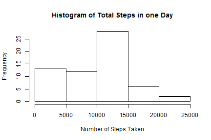
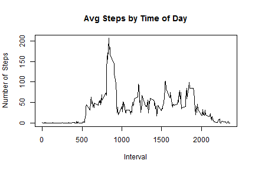
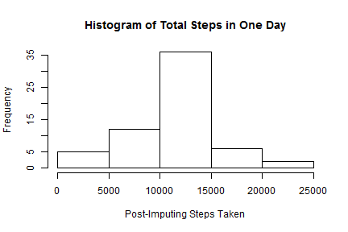
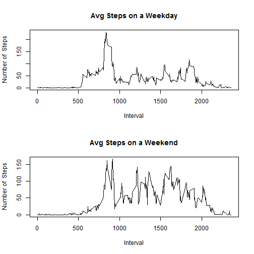

# Reproducible Research: Peer Assessment 1


## Loading & Preprocessing  
- Read the csv file
- Convert the date field from character to R Date format

```r
act <- read.csv("activity.csv", header=TRUE, stringsAsFactor=FALSE)
act$date <- as.Date(act$date, "%Y-%m-%d")
```

## Steps histogram & summary statistics
- Step Count histogram for all intervals
- Step Count histogram only if one or more steps were taken

```r
stepsMatrix <- matrix(act$steps, nrow=288)  
avgStepsByTimeOfDay <- rowMeans(stepsMatrix, na.rm=TRUE)
totalStepsPerDay <- colSums(stepsMatrix, na.rm=TRUE)
dayIntervals <- act$interval[1:288]

hist(totalStepsPerDay, xlab="Number of Steps Taken", main="Histogram of Total Steps in one Day")
```

 

```r
meanSteps <- mean(totalStepsPerDay)
medianSteps <- median(totalStepsPerDay)
```
The mean number of steps is 9354.2295 and the median is 1.0395 &times; 10<sup>4</sup>

## Average Daily activity pattern
There are 288 5-minute intervals in a day. We need to average the steps taken for each of these 288 intervals, for 61 days.

```r
plot(dayIntervals, avgStepsByTimeOfDay, type="l", xlab="Interval", ylab="Number of  Steps", main="Avg Steps by Time of Day")
```

 
The time of day when the average steps taken is highest is 8.35 hours.minutes after midnight

## Imputing Missing Values
- Number of incomplete rows (having NA)
- Impute missing values, base on average steps taken
- Create the imputed dataframe, act2

```r
numMissingRows <- nrow(act) - sum(complete.cases(act))
imputedSteps <- act$steps
# When i=288, 576, 864 etc, the remainder index i %% 288 will be 0, and raise an error, so use ifelse
for(i in 1:length(imputedSteps)) {
  if(is.na(imputedSteps[i])) {
    imputedSteps[i] <- avgStepsByTimeOfDay[ifelse((i %% 288 == 0),288,i %% 288)]
  }
}
act2 <- cbind(imputedSteps, act[,2:3])
```


```r
stepsMatrix2 <- matrix(act2$imputedSteps, nrow=288)  
avgStepsByTimeOfDay2 <- rowMeans(stepsMatrix2, na.rm=TRUE)
totalStepsPerDay2 <- colSums(stepsMatrix2, na.rm=TRUE)
hist(totalStepsPerDay2, xlab="Post-Imputing Steps Taken", main="Histogram of Total Steps in One Day")
```

 

```r
meanSteps2 <- mean(totalStepsPerDay2)
medianSteps2 <- median(totalStepsPerDay2)
```
The new mean steps is 1.0766 &times; 10<sup>4</sup> steps. The new median steps is 1.0766 &times; 10<sup>4</sup> steps  

Both mean and median have increased because the NAs have a value, instead of being counted as zero while calculating total steps in a day.

## Weekday Vs Weekend Pattern
- Create a new factor variable in act2 named "weekdayOrWeekend""
- Subset the imputed dataset by Weekday or Weekend
- Create Panel Plot

```r
act2$dow <- weekdays(act2$date, abbreviate=TRUE)  # dow = Day of Week
act2$weekdayOrWeekend <- factor(ifelse((act2$dow %in% c("Sat", "Sun")),"weekend", "weekday"))
act2Weekday <- subset(act2, act2$weekdayOrWeekend=="weekday")
act2Weekend <- subset(act2, act2$weekdayOrWeekend=="weekend")
stepsWeekday <- matrix(act2Weekday$imputedSteps, nrow=288)
stepsWeekend <- matrix(act2Weekend$imputedSteps, nrow=288)
avgStepsWeekday <- rowMeans(stepsWeekday)
avgStepsWeekend <- rowMeans(stepsWeekend)
par(mfrow=c(2,1)) # Both plots will be in one figure
plot(dayIntervals, avgStepsWeekday, type="l", xlab="Interval", ylab="Number of  Steps", main="Avg Steps on a Weekday")
plot(dayIntervals, avgStepsWeekend, type="l", xlab="Interval", ylab="Number of  Steps", main="Avg Steps on a Weekend")
```

 
